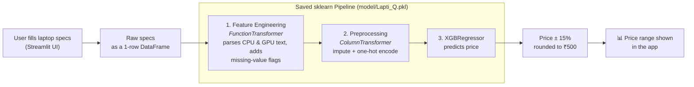

# 💻 LaptiQ: Laptop Price Predictor

**Enter a laptop's specs. Get a fair market price range for the Indian market.**

LaptiQ is an end-to-end machine learning project: a scraped-style dataset of ~8,200 Indian laptop listings, a full data-cleaning and feature-engineering pipeline, a comparison of 8 regression algorithms, and a tuned **XGBoost** model served through a **Streamlit** web app.

🔗 **Live demo:** [laptiq.streamlit.app](https://laptiq.streamlit.app)

| R² Score | Avg. Prediction Error (MAPE) | Laptops Trained On |
|:---:|:---:|:---:|
| **86.26%** | **14.59%** | ~7,600 (after cleaning) |

*Scores are 10-fold cross-validated, measured on the final training pipeline (`src/train.py`).*

---

## 📖 Table of Contents

1. [What does it do?](#-what-does-it-do)
2. [How it works (architecture)](#-how-it-works-architecture)
3. [The dataset](#-the-dataset)
4. [How I built it](#-how-i-built-it)
   - [Step 1: Exploratory Data Analysis](#step-1--exploratory-data-analysis)
   - [Step 2: Feature Engineering](#step-2--feature-engineering)
   - [Step 3: Model Comparison](#step-3--model-comparison)
   - [Step 4: The final model](#step-4--the-final-model)
5. [The web app](#-the-web-app)
6. [Project structure](#-project-structure)
7. [Run it locally](#-run-it-locally)
8. [Design decisions](#-design-decisions)
9. [Tech stack](#-tech-stack)

---

## 🎯 What does it do?

Buying (or selling) a laptop in India means comparing dozens of specs (processor generation, GPU tier, RAM, storage, display) and guessing what they're collectively worth. LaptiQ does that estimate for you.

**You provide:** brand, processor, GPU, RAM, storage, display, weight, and so on.
**You get:** an estimated price range in ₹, plus the single most likely price.

> Example output: **₹68,000 – ₹92,000** *(most likely around ₹79,990)*

The range is the model's prediction ±15%, rounded to the nearest ₹500. This is deliberate: a laptop's price depends on things no spec sheet captures (sales, seller, stock), so a range is more honest than a single number.

---

## 🏗 How it works (architecture)

The whole system is **one saved scikit-learn `Pipeline`**. The web app never re-implements any cleaning logic; it hands the raw form inputs to the pipeline and the pipeline does everything.



- the app and the training code can never disagree on how data is prepared,
- imputers and encoders are learned **only from training folds** during cross-validation (no data leakage),
- one `joblib.dump` / `joblib.load` is all deployment needs.

---

## 📦 The dataset

| | |
|---|---|
| **Source file** | `data/Laptop Dataset.csv` |
| **Raw size** | 8,198 rows × 20 columns |
| **After cleaning** | ~7,590 rows (65 duplicates removed, ~6.5% of rows had no price and were dropped) |
| **Target** | `Price (Rs)` |

**Raw columns:** Brand, Series, Weight, Operating System, Display Size, Display Resolution, Pixel Density (PPI), Display Type, Touchscreen, Processor, Clock Speed, Graphic Processor, RAM, RAM Type, RAM Speed, SSD Capacity, Refresh Rate, Graphics Memory, HDD Capacity, Price.

**The challenge:** the data is messy in the way real data is.

| Column | Missing values |
|---|---|
| HDD Capacity | 77% |
| Graphics Memory | 62% |
| Refresh Rate | 62% |
| Display Type | 47% |
| RAM Speed | 38% |

On top of that, `Processor` has **749** distinct text values and `Graphic Processor` has **338** (e.g. `"Intel Core i7-13700H (13th Gen)"`, `"AMD Quad-Core Ryzen 3 - 7335U"`). These can't be fed to a model as-is. Turning that free text into meaningful features was the most important part of the project.

---

## 🔨 How I built it

### Step 1 · Exploratory Data Analysis
📓 `notebooks/Exploratory Data Analysis.ipynb`

For **every** column I checked missing values, skewness, distribution, and its relationship with price, then made an explicit decision:

| Decision | Columns | Reasoning |
|---|---|---|
| **Drop** | `Series`, `Display Size`, `Display Resolution` | *Series* has 534 unique values and adds noise; *Display Size* correlates weakly with price; *Resolution* is already captured by **PPI** (pixels-per-inch, computed from resolution and screen size) |
| **Drop rows** | Missing `Price`, duplicates | Can't learn from an unknown target |
| **Median imputation** | Weight, PPI, Clock Speed | Right-skewed, so the median is safer than the mean |
| **Median + "was missing" flag** | RAM Speed, Refresh Rate | Too many gaps to ignore, and *being* missing carries information (budget laptops rarely list these) |
| **Fill with 0** | Graphics Memory, SSD, HDD | A blank here means the laptop has *no* dedicated GPU / SSD / HDD; zero is the truth, not a guess |
| **Group rare categories → `Other`** | Brand, OS, RAM Type, Display Type | Avoids dozens of near-empty one-hot columns |

I also tested log and Yeo-Johnson transforms on each numeric feature. None improved the correlation with price meaningfully, so the original features were kept.

### Step 2 · Feature Engineering
📓 `notebooks/Feature Engineering.ipynb` → 🐍 `src/feature_engineering.py`

The key idea: **don't give the model raw processor names, give it what a buyer actually cares about: brand and performance tier.**

From `Processor` I extract three features using regex rules:

| New feature | Meaning | Example |
|---|---|---|
| `CPU Brand` | intel / amd / apple / qualcomm / mediatek | `"Intel Core i7-13700H"` → `intel` |
| `CPU Segment` | low / mid / high tier of the chip family | `i3, Ryzen 3, Celeron` → **low**; `i5, Ryzen 5` → **mid**; `i7, i9, Ryzen 7/9, M-Pro/Max` → **high** |
| `CPU Series` | low / mid / high tier of the *suffix* (power class) | `U, Y, G` (thin & low-power) → **low**; `P` → **mid**; `H, HX, HS` (performance) → **high** |

From `Graphic Processor` I extract:

| New feature | Meaning | Example |
|---|---|---|
| `GPU Brand` | nvidia / amd / intel / apple / qualcomm / mediatek | `"NVIDIA GeForce RTX 4060"` → `nvidia` |
| `GPU Series` (a.k.a. *GPU Segment*) | low / mid / high tier | `Intel UHD, Iris` → **low**; `RTX 3050/4050/4060` → **mid**; `RTX 4070+` → **high** |

Two more small features: `Missing RAM Speed` and `Missing Refresh Rate` (0/1 flags).

I also considered `CPU Generation` (11th gen, 12th gen…) but dropped it: its correlation with price was weak (≈0.14).

**Multicollinearity check:** I computed the Variance Inflation Factor (VIF) for all features. Several were high (Weight, PPI, RAM Speed), which is expected for laptops (bigger screens are heavier, and so on). This is a problem for linear models but harmless for tree-based models, which is one reason tree ensembles did better.

### Step 3 · Model Comparison
📓 `notebooks/` (one notebook per algorithm)

Every model got the same treatment: same 80/20 split (`random_state=69`), `GridSearchCV` (5-fold) for tuning, then a **10-fold cross-validation** for the final score, so the comparison is fair.

| # | Model | R² (10-fold CV) | MAPE ↓ | Notes |
|:-:|---|:---:|:---:|---|
| 1 | **XGBoost** ✅ | **85.14%** | **15.33%** | Best overall |
| 2 | Random Forest | 84.60% | 16.39% | Very close, but slow to train (~32 s vs ~4 s) |
| 3 | Gradient Boosting | 84.28% | 16.44% | |
| 4 | KNN | 79.95% | 18.80% | |
| 5 | Linear Regression | 78.42% | 22.81% | Scaling, log/Yeo-Johnson transforms, Ridge and Lasso gave no gain |
| 6 | SVM (linear) | 76.75% | 19.85% | |
| 7 | Decision Tree | 76.03% | 20.17% | |

*MAPE = Mean Absolute Percentage Error: "on average, the prediction is X% away from the real price."*

**What I learned from the experiments**

- **Boosted/ensemble trees clearly beat everything else**: laptop pricing is non-linear (e.g. going from 8 GB → 16 GB RAM matters more than 16 → 32).
- **Log-transforming the target** consistently *lowered* R² slightly but *improved* MAPE. Since the goal is "be close in percentage terms across cheap and expensive laptops", this was worth testing on every model. For XGBoost the untransformed target with an absolute-error objective worked best.
- Regularization (Ridge/Lasso) and feature scaling did nothing for linear regression, confirming the limit was the *model type*, not overfitting.

### Step 4 · The final model
🐍 `src/train.py`

XGBoost won, so `train.py` rebuilds the whole workflow as a single production pipeline:

```python
model = Pipeline([
    ("Feature Engineering", FunctionTransformer(feature_engineer)),
    ("Preprocessing",       ColumnTransformer([...])),   # impute + one-hot encode
    ("XGB", XGBRegressor(
        objective="reg:absoluteerror",
        learning_rate=0.1, max_depth=7, n_estimators=700,
        reg_alpha=10, reg_lambda=1,
    )),
])
```

**Hyperparameters** were found with grid search (objective, tree count, depth, learning rate, then L1/L2 regularization in a second pass).

**Preprocessing inside the pipeline:**

| Feature group | Handling |
|---|---|
| Weight, PPI, Clock Speed, RAM Speed, Refresh Rate | median imputation |
| Graphics Memory, SSD, HDD | fill with `0` |
| Brand, OS, RAM Type, GPU/CPU categories, Touchscreen | fill `"Unknown"` + one-hot encode; categories under 1% frequency are grouped as "infrequent" |
| Display Type | same, with a lower 0.1% threshold |
| RAM (GB), missing-value flags | passed through unchanged |

The `handle_unknown="infrequent_if_exist"` setting means that if a user types a brand or display type the model has never seen, it **degrades gracefully instead of crashing**.

---

## 🖥 The web app

`app.py` is a Streamlit app with a custom dark UI, responsive down to phone screens.

**Home page**: the configuration form. Inputs are grouped in rows (brand / CPU / GPU → memory → storage → display → OS & weight).

**Model Info page**: performance stats and a short "how it works" explainer.

A few details that make it friendlier:

- **PPI is calculated for you.** Users pick *resolution* and *screen size* (things they know); the app converts them to pixel density with `√(w² + h²) / size`, which is what the model expects.
- **Processor and GPU are free text** (e.g. `Intel Core i7-13700H`). The pipeline's regex feature engineering turns them into tiers, so users don't need to know how the model categorizes chips.
- **Input validation**: the Predict button warns if the processor or GPU is left empty.
- **Indian number formatting**: prices display as `₹1,05,999`, not `₹105,999`.
- **Model is cached** with `@st.cache_resource`, so it's loaded once, not on every click.

---

## 📁 Project structure

```
LaptiQ/
├── app.py                        # Streamlit web app
├── requirements.txt
├── .gitignore
│
├── data/
│   ├── Laptop Dataset.csv            # raw data (8,198 rows)
│   └── Cleaned Laptop Dataset.csv    # output of the feature-engineering notebook
│
├── model/
│   └── Lapti_Q.pkl               # trained pipeline (created by train.py)
│
├── src/
│   ├── feature_engineering.py    # CPU/GPU parsing + missing flags (used in the pipeline)
│   └── train.py                  # builds, evaluates and saves the final pipeline
│
└── notebooks/
    ├── Exploratory Data Analysis.ipynb
    ├── Feature Engineering.ipynb
    ├── Linear Regression.ipynb
    ├── Decision Trees.ipynb
    ├── Random Forest.ipynb
    ├── Gradient Boosting.ipynb
    ├── KNN.ipynb
    ├── SVM.ipynb
    └── XG-BOOST.ipynb
```

---

## 🚀 Run it locally

**1. Clone and install**

```bash
git clone <your-repo-url>
cd LaptiQ
pip install -r requirements.txt
```

**2. (Optional) Retrain the model**

```bash
python src/train.py
```

This trains on `data/Laptop Dataset.csv`, prints the 10-fold CV scores, and saves `model/Lapti_Q.pkl`.

**3. Launch the app**

```bash
streamlit run app.py
```

Then open the local URL Streamlit prints (usually `http://localhost:8501`).

> **Note:** `app.py` adds `src/` to the Python path so that the saved pipeline can find `feature_engineering.py` when it's loaded. Keep that file in `src/`.

---

## 🧠 Design decisions

- **Domain-driven features beat raw text.** Collapsing 749 processor strings into `brand + segment + series` gave the model signal it could actually use.
- **Missing ≠ unknown.** A blank *HDD* means "no HDD" → `0`. A blank *Refresh Rate* is genuinely unknown → median **plus** a flag. Treating these two cases differently mattered.
- **The loss function matches the goal.** The final XGBoost uses `reg:absoluteerror`, which is more robust to the very expensive outliers (gaming and workstation laptops) than squared error.
- **Fair comparison.** Every algorithm used the same split, the same tuning method, and 10-fold CV.
- **No leakage in production.** In `train.py`, all imputers and encoders are fit inside cross-validation folds.
- **A range, not a point.** Communicates uncertainty honestly.

---

## 🛠 Tech stack

| Purpose | Tools |
|---|---|
| Language | Python |
| Data & analysis | pandas, NumPy, Matplotlib, Seaborn, statsmodels (VIF) |
| Modeling | scikit-learn (Pipeline, ColumnTransformer, GridSearchCV), XGBoost |
| Persistence | joblib |
| Web app | Streamlit |
| Deployment | Streamlit Community Cloud |

---

<p align="center">Built by <b>Yash</b> · If you found this useful, consider giving the repo a ⭐</p>